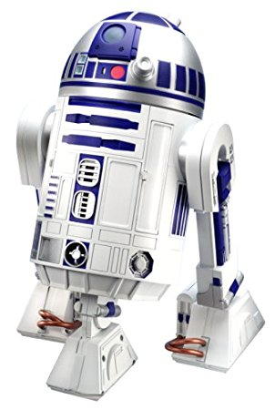

# ros2d2
*ros2d2* is a ROS stack to make R2D2-like sounds. It is based on the following libraries;
- <a href="http://kevinboone.net/README_r2d2-voice.html">r2d2-voice</a> to synthesize prametric beep sounds (like whistle sound)
- <a href="https://pypi.python.org/pypi/ttastromech">ttastromech</a> to transform texts into R2D2 sounds


## Installation

```
pip install ttastromech
```

## Usage
```
roslaunch ros2d2 ros2d2.launch
```

```
# play a preset beep sound
$ rostopic pub /ros2d2_node/preset std_msgs/String "data: 'whistle'"

# generate R2D2 sound from a text
$ rostopic pub /ros2d2_node/speak std_msgs/String "data: 'hello'"
```


## Topics
#### /ros2d2_node/preset
Play preset beep sounds synthesized by *r2d2-voice*. You can play the following presets; whistle, tonedown, toneup, failure, alert, confuse, and calculate. The presets are defined by a csv file at *data/presets*. You can add new sounds by adding commands to the file.

#### /ros2d2_node/speak
Play R2D2 voice transformed from a text string using *ttastromech*. It makes sound by translating each character in the text to a corresponding predefined R2D2 sound. 

#### /ros2d2_node/cmd_synth
Play sounds by directly giving commands to *r2d2-voice*. See <a href="http://kevinboone.net/README_r2d2-voice.html">r2d2-voice</a> for the details of the command.
